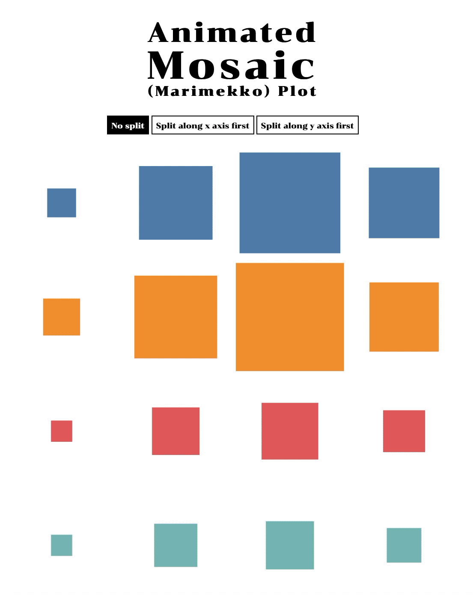

# Animated Mosaic Plot

Animating between horizontal and vertical mosaic (Marimekko) plots. The data is from the answers to an IPPD survey on the perceptions on average work hours (x-axis; 6-7, 7-8, 8-9, and 9-10 hours, from left to right) and annual GDP growth (y-axis; 2%, 3%, 4%, and 5%, from top to bottom) of Thailand.

